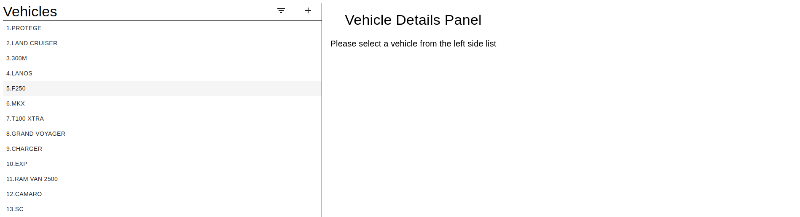

# Vehicle Listing Application 

### The project is to build a simple vehicle listing web page using json-server for the backend api calls and react for building the frontend page.

### Libraries used for building the project
* Json-Server 
* Axios 
* React-infinite-scroll-component
* Redux
* Redux-Thunk
* Material-UI
  